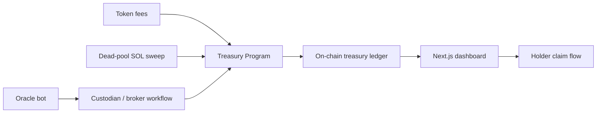

# CSTR (Chinese Strategy)


CSTR is a Solana-native treasury and governance prototype designed to accumulate value from token fees, dead-pool SOL, and other on-chain treasury inflows, then allocate capital into off-chain Chinese equity exposure through a custodied workflow. The repository is a runnable monorepo scaffold for the treasury program, token module, oracle bot, dashboard, and tests.

## Project overview

CSTR combines three core ideas:

- A treasury vault program on Solana that records inflows, asset purchases, and distributions.
- A token module that can route creator or transfer fees into the treasury.
- An off-chain oracle service that watches wallets for abandoned SOL balances and logs custodied equity purchases as signed attestations on-chain.

This project is intentionally structured as a foundation for further iteration. Some components are implemented as working scaffolds, while others are clearly marked as placeholders for production-grade integrations.

## Architecture



## Repository structure

- programs/cstr-treasury: Anchor program for treasury state, asset purchase records, snapshots, and claims.
- programs/cstr-token: SPL-style token scaffold with fee configuration hooks.
- oracle-bot: TypeScript service for monitoring wallets and reconciling purchases.
- app: Next.js dashboard for public treasury browsing and holder claims.
- tests: Anchor test skeleton for treasury flows and edge cases.

## Prerequisites

Install the following tools before you begin:

- Rust
- Anchor 0.30+
- Solana CLI
- Node.js 20+
- npm or yarn

## Quick start

### 1. Install dependencies

```bash
cargo check
npm install
npm --prefix oracle-bot install
npm --prefix app install
```

### 2. Run the Anchor tests

```bash
anchor test
```

### 3. Start the dashboard

```bash
npm --prefix app run dev
```

### 4. Start the oracle bot

```bash
npm --prefix oracle-bot run dev
```

## Example environment variables

Create an environment file for the bot:

```bash
cat > oracle-bot/.env <<'EOF'
RPC_URL=https://api.devnet.solana.com
TREASURY_PROGRAM_ID=11111111111111111111111111111111
TARGET_WALLETS=11111111111111111111111111111111,22222222222222222222222222222222
DUST_THRESHOLD_LAMPORTS=1000000
BROKER_API_URL=https://example.com
BROKER_API_KEY=replace-me
EOF
```

## Notes on compliance and custody

This project includes off-chain custody and real-world asset exposure. It is not purely on-chain and should be reviewed by legal, compliance, and custody specialists before any mainnet deployment. The oracle bot is designed to log attestations and reconcile purchases, but the actual brokerage integration must be implemented with appropriate controls and secrets management.

## Next steps

Recommended next steps for productionization:

1. Replace placeholder program IDs with real deployed addresses.
2. Add real SPL token mint logic and fee-routing integration.
3. Connect the dashboard to on-chain account data and event indexing.
4. Integrate a compliant custodian or broker API.
5. Add governance controls for multisig authority and upgrade policy.
